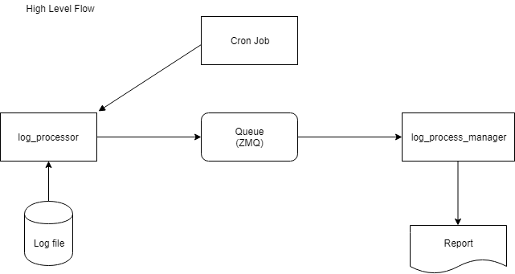

# Log Monitor
* Python based application to monitor log files.

### Introduction
* `log_monitor` is a Python based application for monitoring rotating log files. It is roughly based on a publisher-subscriber model, where in one application checks for a particular error pattern in the log files and places that information onto a queue (ZMQ). Another application waits for the information to be available on the queue and uses it.




### Technology
`log_monitor` is developed using Python 3 and makes use of:
* `zmq` - ZeroMQ is used as the queue. `zmq` package is the Python binding. 
* `pandas` - Pandas is used for producing report.

### Sample usage:
* On one terminal first run the manager application:
```bash
$ python3 core/log_process_manager.py
```
* On another terminal run the log processor application:
```bash
$ python3 core/log_processor.py
```
* A sample log simulator application is also provided for testing. It can be run using:
```bash
$ python3 utils/log_simulator.py
```

### Development
Clone the git repo and follow the steps below on any linux  machine.

    git clone https://github.com/icgowtham/log_monitor.git
    cd log_monitor

Setup python virtual environment.

    make setup-env
    source env3/bin/activate


### Compliance

To validate compliance, complexity and coverage:

    make compliance <code_path>

### Tests

To run the unit tests in folder unit_tests_path:

    make test <unit_test_path>

### References

| Topic   | Link  |
| ------  | ------|
| Zero MQ | http://zeromq.org/ |
| Pandas  | https://pandas.pydata.org/ |

### TODO
* Add more unit tests.
* Handle the case where there are more than one rotated logs. Right now, this application assumes that there will be only one rotated log.
* Handle some edge cases.